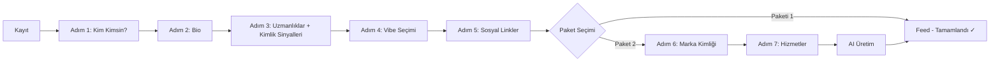

# Alvera — Sistem Mimarisi

## 1. Genel Yapı

Alvera, Flask Application Factory deseni üzerine kurulu modüler bir web uygulamasıdır.

```
┌─────────────────────────────────────────────────────────────┐
│                     ALVERA PLATFORM                         │
├──────────────────────┬──────────────────────────────────────┤
│   Alvera Social      │         Alvera Profil               │
│   (Ücretsiz)         │         (Ücretli)                   │
│                      │                                      │
│  • Sosyal Akış (Feed)│  • AI Landing Page                  │
│  • Flow / Keşif      │  • Portföy & Hizmetler              │
│  • Direkt Mesaj (DM) │  • Testimonials                     │
│  • Bildirimler       │  • Site Yönetimi                    │
│  • MindMap           │  • Marka Varyantları                │
│  • Aura Analizi      │                                     │
└──────────────────────┴──────────────────────────────────────┘
```

---

## 2. Uygulama Akışı

```
Browser Request
      │
      ▼
┌─────────────┐
│   Flask App │  (create_app — app.py)
│             │
│  before_req │  → Onboarding Koruyucu
│             │    (tamamlanmamış kullanıcıları redirect eder)
└──────┬──────┘
       │
       ▼
┌─────────────────────────────────────────────────────────┐
│                   BLUEPRINT ROUTER                       │
│                                                         │
│  /auth/*        /feed/*     /flow/*   /dm/*             │
│  /onboarding/*  /site/*     /ai/*     /mindmap/*        │
│  /posts/*       /brand/*    /extras/* /notifications/*  │
│  /admin/*       /@<slug>                                │
└──────────────────────────┬──────────────────────────────┘
                           │
                    ┌──────┴──────┐
                    │             │
              ┌─────▼─────┐ ┌────▼────────┐
              │  SQLite DB │ │  AI Service │
              │  (models)  │ │  (Groq API) │
              └────────────┘ └─────────────┘
```

---

## 3. Katman Mimarisi

### 3.1 Sunum Katmanı (Presentation Layer)
- **Jinja2 şablonları** — `templates/` dizini
- **Vanilla CSS & JavaScript** — `static/css/`, `static/js/`
- Partial şablonlar (`_` öneki): yeniden kullanılabilir bileşenler
  - `_feed_post.html`, `_aura_overlay.html`, `_dm_message.html` vb.

### 3.2 Route Katmanı (Blueprint Layer)
13 Blueprint, her biri kendi sorumluluk alanını kapsar:

| Blueprint | Prefix | Sorumluluk |
|-----------|--------|------------|
| `main_bp` | `/` | Landing, public profil, discover |
| `auth_bp` | `/auth` | Kayıt, giriş, çıkış |
| `onboarding_bp` | `/onboarding` | 7 adımlı profil kurulum sihirbazı |
| `feed_bp` | `/feed` | Sosyal akış, gönderi CRUD |
| `flow_bp` | `/flow` | PRISM keşif algoritması |
| `dm_bp` | `/dm` | Direkt mesajlaşma |
| `ai_bp` | `/ai` | AI işlemleri (landing, mindmap, aura) |
| `mindmap_bp` | `/mindmap` | Zihin haritası |
| `site_bp` | `/site` | Kişisel site yönetimi |
| `brand_bp` | `/brand` | Marka profil yönetimi |
| `notifications_bp` | `/notifications` | Bildirim sistemi |
| `posts_bp` | `/posts` | Gönderi detay ve yönetim |
| `extras_bp` | `/extras` | Profil ek özellikleri |
| `admin_bp` | `/admin` | Admin panel |

### 3.3 Servis Katmanı (Service Layer)
- `services/ai_service.py` — Groq API ile tüm AI işlemleri

### 3.4 Veri Katmanı (Data Layer)
- `models.py` — SQLAlchemy ORM modelleri (20+ model)
- `extensions.py` — `db` ve `login_manager` örnekleri
- SQLite veritabanı — `instance/alvera.db`

---

## 4. Kimlik Doğrulama & Yetkilendirme

```
Kayıt → Onboarding (7 adım) → Feed (korumalı alan)

Onboarding Koruyucu (before_request):
  ├── Giriş yapılmamış: Flask-Login @login_required halleder
  ├── Muaf blueprints: auth, onboarding, main, admin
  └── Onboarding tamamlanmamış: /onboarding'e redirect
```

**Oturum yönetimi:** Flask-Login + werkzeug parola hash'leri

---

## 5. Dosya Yükleme

- Upload dizini: `static/uploads/{user_id}/`
- Maksimum dosya boyutu: 100 MB
- Erişim URL'si: `/uploads/<user_id>/<filename>`
- Desteklenen içerik: profil fotoğrafı (avatar), kapak görseli (cover), gönderi medyaları

---

## 6. Veritabanı Yönetimi

### İnkremental Migrasyon Stratejisi
Alvera, `Flask-Migrate` yerine elle yazılmış `ALTER TABLE` komutlarıyla migrasyon yapıyor:

```python
# app.py — DB Init bloğunda
_migs = [
    "ALTER TABLE dm_messages ADD COLUMN msg_type VARCHAR(20) ...",
    "ALTER TABLE posts ADD COLUMN code_language VARCHAR(30)",
    ...
]
for _sql in _migs:
    try:
        db.session.execute(text(_sql))
    except Exception:
        db.session.rollback()  # Sütun zaten varsa sessizce geç
```

---

## 7. Onboarding Akışı



---

## 8. Güvenlik Notları

- Şifreler `werkzeug.security.generate_password_hash` ile saklanır
- `SQLAlchemy` parametreli sorgu kullanır (SQL injection koruması)
- `SECRET_KEY` ortam değişkeninden okunur
- Gönderi URL'leri sıralı ID yerine rastgele 10 karakterlik `slug` kullanır
